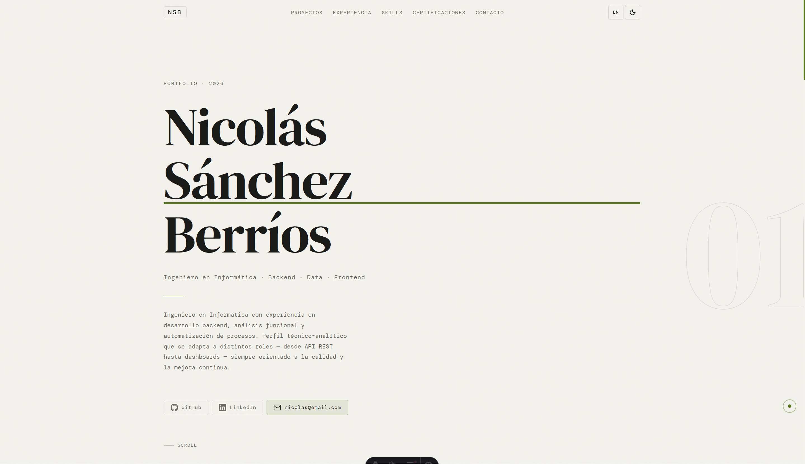
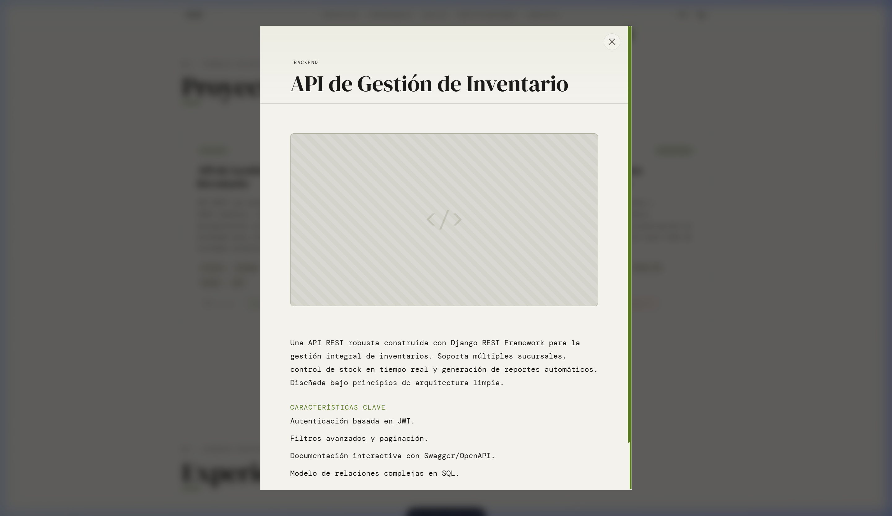
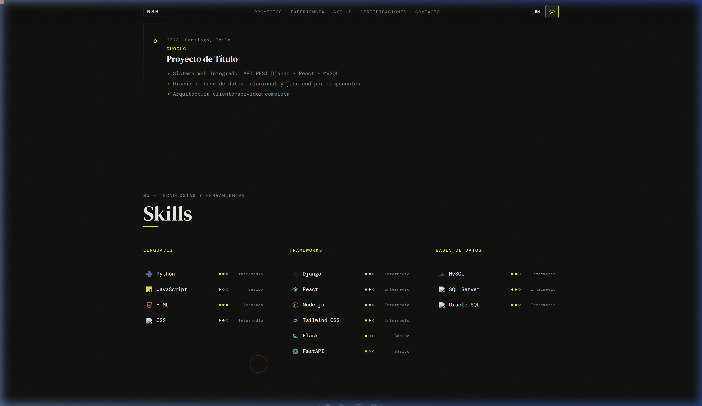

# Portfolio Web · Nicolás Sánchez Berríos

[](https://astro.build)
[](https://reactjs.org/)
[]()

Portfolio personal de **Nicolás Sánchez Berríos**, Ingeniero en Informática con perfil técnico-analítico.
Construido enfocándose firmemente en la velocidad, rendimiento SEO y una estética sofisticada del estilo *Minimalista Documental / Dopamine Decor*.

---
|
## 📸 Capturas de Pantalla

### Vista Principal (Tema Claro)


### Detalles Interactivos (Modales Bilingües)


### Soporte Nativo para Modo Oscuro


---

## ✨ Características Principales

- **Arquitectura Astro + React Islands**: Aprovechando el motor *Static Site Generator* ultra-ligero de Astro, combinado con componentes de React que solo se renderizan y descargan sus scripts donde es intrínsecamente necesario (toggles de tema, cursor).
- **Internacionalización (i18n)**: Soporte de traducción multi-lenguaje (Inglés / Español) implementado puramente desde el lado del cliente y almacenado en memoria local para una conmutación instantánea.
- **Diseño Adaptativo (Dual)**: Integración total entre Modos Oscuro y Claro respaldada por variables maestras CSS sin recargas innecesarias.
- **Cursor de Usuario Perceptible**: Cursor interactivo construido en React, que detecta vínculos web para crear una retroalimentación envolvente sin estropear a pantallas de menor tamaño y navegadores táctiles de smartphones.
- **Ventanas Modales HTML5**: Arquitectura ligera gestionada en JavaScript Vanilla sin engordar la página base de librerías extrañas de UI.

## 🛠️ Stack Tecnológico

1. **Estructura Base**: [Astro](https://astro.build/) (v5)
2. **Interactividad**: [React](https://react.dev/) + TypeScript
3. **Estilización Visual**: Vanilla CSS utilizando Grid/Flexbox moderno. Las variables de colores asimétricos y modos duales se agrupan en `global.css`.
4. **Gráficos e Iconos**: [Lucide React](https://lucide.dev/) (iconografía lineal UI) y [Simple Icons](https://simpleicons.org/) (marcas tech / branding).

## 🚀 Inicio y Despliegue Local

Para correr este proyecto en tu entorno local:

1. Clona este repositorio.
2. Accede al directorio `Portafolio` principal.
3. Asegúrate de tener Node.js instalado e instala las dependencias:

```bash
npm install
```

4. Ejecuta el servidor de desarrollo ultrarrápido:

```bash
npm run dev
```

> **Nota**: El puerto predeterminado será `localhost:4321`. Se reflejará cualquier modificación de inmediato (HMR activo).

Para compilar el proyecto enfocado a producción y despliegue:

```bash
npm run build
```

---
*Hecho para el mundo real, con precisión.*
